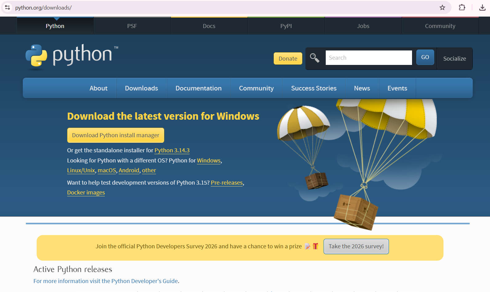
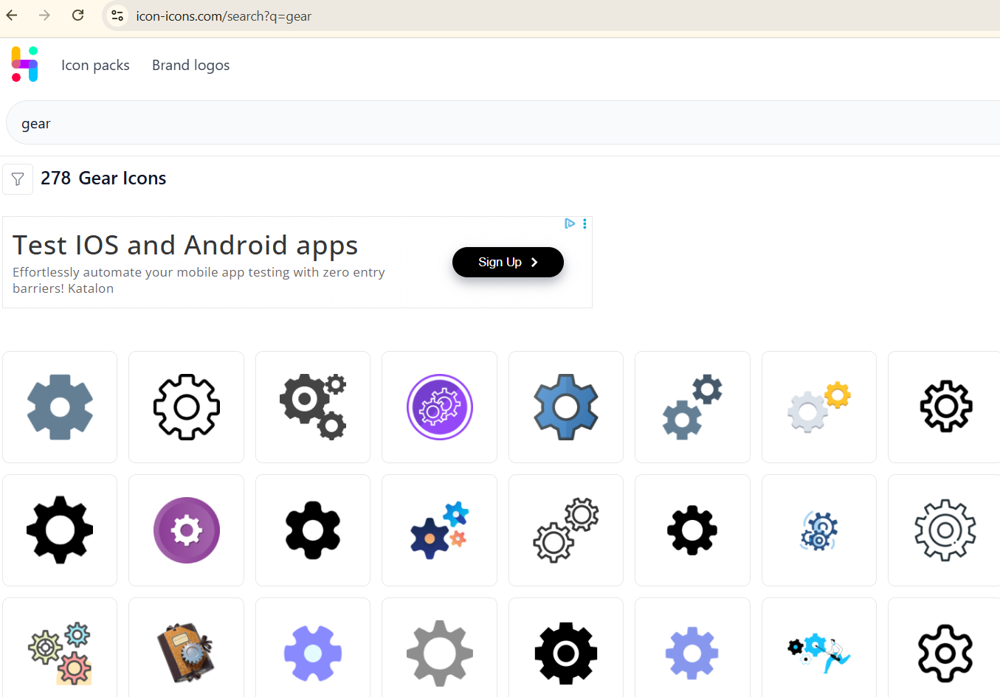

# python-keylogger-project-Email
Educational cybersecurity project demonstrating keyboard input logging in Python

**Project Setup**

**1. Install Python**

Download and install Python 3.x.
### Python Installation

During installation, make sure to enable the option:

Add Python to PATH

This allows Python commands to run from the Command Prompt.

**2. Create the Project Folder**

Create a new folder for the project:

keylogger_creation

All project files will be stored inside this folder.

**3. Add an Application Icon**

Download an .ico icon file (for example a gear icon) and place it inside the project folder.
### Download icon

Rename the file to:

icon.ico

Make sure file extensions are enabled in Windows so the file name appears correctly.

**4. Verify Python Installation**

Open Command Prompt and run:

python --version

If Python is installed correctly, the version number will be displayed.

**5. Install Required Libraries**

Install the required Python dependency:

pip install pynput

This library allows Python programs to detect keyboard input events for educational demonstration.

**6. Install Additional Tools**

Install PyInstaller, which allows converting Python scripts into standalone executable files.

pip install pyinstaller

**7. Create the Python File**

Inside the project folder:

Create a new text file

Rename it to:

keylogger.py

Open the file in a code editor and paste your Python program that demonstrates keyboard input logging.

Make sure the program is only used on systems you own or have permission to test.

**8. Run the Program**

Open the terminal inside the project folder and run:

python keylogger.py

When you type on the keyboard, the program will capture and display the keystrokes in the console for demonstration purposes.

**9. Build the Program** (Optional)

To convert the Python script into an executable file, run:

pyinstaller -w -F keylogger.py --icon=icon.ico

After running this command, two folders will be created:

build
dist

Inside the dist folder you will find the generated executable file.

**Educational Purpose**
This project demonstrates how keyboard input monitoring works and why it can be dangerous if misused.

**Understanding these techniques helps cybersecurity professionals:**

Detect malicious software
Protect sensitive information
Improve system security
Important Disclaimer

This project is intended strictly for educational cybersecurity learning.
Do not run monitoring software on computers without permission.
This project should only be tested on systems you own or have explicit authorization to use.
